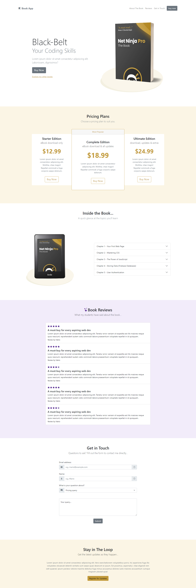

# Book Pro

✨Responsive Bootstrap website.
- use npm install to install dependencies and see this project.
- Using Bootstrap5 to style this website.
- In this project we customized colors and theme by Sass.

- Tutorial for this project was from youtube channel the Net Ninja. 
[▶️ Tutorial video from the Net Ninja](https://www.youtube.com/watch?v=O_9u1P5YjVc&list=PL4cUxeGkcC9joIM91nLzd_qaH_AimmdAR)

--------------------------------
