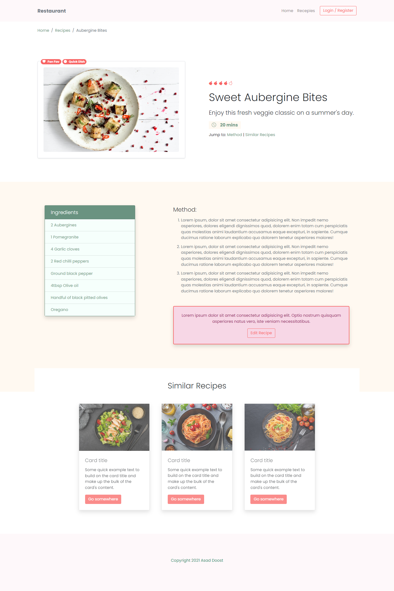

# Restaurant website

✨Responsive Bootstrap website.
- use npm install to install dependencies and see this project.
- Using Bootstrap5 and Sass to style this website.
- In this project we customized colors, fonts, theme, size and more by Sass.

- Tutorial for this project was from the Net Ninja website.
[▶️ Tutorial video from the Net Ninja](https://netninja.dev/courses/customizing-bootstrap-5)

--------------------------------